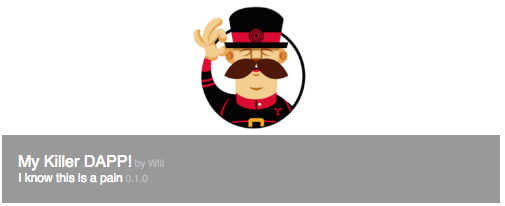
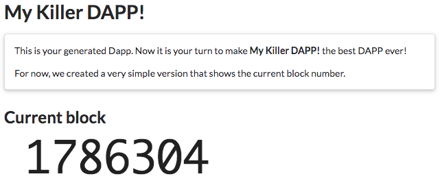

# generator-ethdapp 
Chevdor, <chevdor@gmail.com>
v0.1, 2014-08-24
:idprefix:
:idseparator: -
:experimental:
:endash:

ifdef::env-github[]
image:https://travis-ci.org/chevdor/generator-ethdapp.svg?branch=master["Build Status", link="https://travis-ci.org/chevdor/generator-ethdapp"]
endif::env-github[]

:proj: generator-ethdapp

== First look

image::https://asciinema.org/a/89762.png[link='https://asciinema.org/a/89762']

== Getting Started

=== What is this generator about?
*{proj}* is all about getting started quickly. Running this generator will build a simple dapp for Ethereum. Better than just a boilerplate, the generated file is already tuned with your name, etc...

Read on a give a try.

=== What is Yeoman?

Trick question. It's not a thing. It's this guy:

image:http://i.imgur.com/JHaAlBJ.png[]

Basically, he wears a top hat, lives in your computer, and waits for you to tell him what kind of application you wish to create.

Not every new computer comes with a Yeoman pre-installed. He lives in the [npm](https://npmjs.org) package repository. You only have to ask for him once, then he packs up and moves into your hard drive. *Make sure you clean up, he likes new and shiny things.*

```bash
npm install -g yo
```

=== Yeoman Generators

Yeoman travels light. He didn't pack any generators when he moved in. You can think of a generator like a plug-in. You get to choose what type of application you wish to create, such as a Backbone application or even a Chrome extension.

To install generator-ethdapp from npm, run:

```bash
npm install -g generator-ethdapp
```

Finally, initiate the generator:

```bash
yo ethdapp
```

=== Getting To Know Yeoman

Yeoman has a heart of gold. He's a person with feelings and opinions, but he's very easy to work with. If you think he's too opinionated, he can be easily convinced.

If you'd like to get to know Yeoman better and meet some of his friends, [Grunt](http://gruntjs.com) and [Bower](http://bower.io), check out the complete [Getting Started Guide](https://github.com/yeoman/yeoman/wiki/Getting-Started).

== Generating your Dapp

For a generic Dapp:
```bash
yo ethdapp
```

For a Dapp taylored to Parity:
```bash
yo ethdapp:parity
```

Then answer the questions. Once you are done, run the deploy script:
```bash
./deploy.sh
```

Then (re)start Parity:
```bash
parity ui
```

You will see your app listed there:



Click on that link and you will see your DAPP:




== License

MIT


